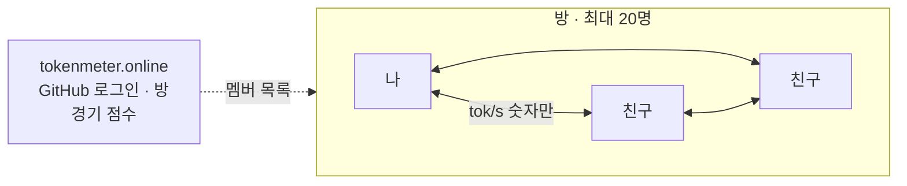
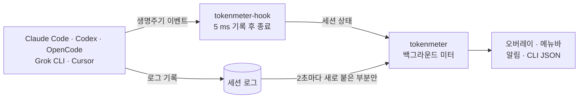
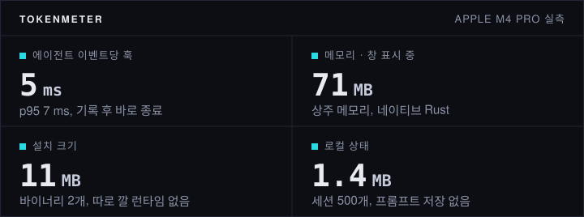

# TokenMeter

**여러 AI 코딩 에이전트 중 누가 일하고, 누가 기다리고, 누가 나를 부르는지 한눈에.**

[](https://github.com/helloimdevman/tokenmeter/actions/workflows/test.yml)
[](https://github.com/helloimdevman/tokenmeter/releases/latest)

[](LICENSE)

Claude Code, Codex, OpenCode, Grok CLI, Cursor 외 코딩 에이전트 44개를 위한 작은 상시 미터입니다. 에이전트가 남기는 로컬 로그를 읽으므로 API 키가 필요 없고, 측정은 네트워크를 쓰지 않습니다.

**0.2.0 새 기능: [Token League](#token-league-친구와-겨루기).** 방을 만들고 친구를 초대하면, 서로의 에이전트가 P2P로 실시간 경쟁합니다.

[English](README.md) · [상세 레퍼런스](docs/reference.ko.md) · [새 에이전트 추가](docs/add-service.md)

```text
┌────────────────────────────────────────────────────┐
│ TOKENMETER                                    오늘 │
│ 478 전체 출력 tok/s                 API 환산 $15.8599 │
│ ██████████████░░░░░░░░░░░░░░░░░░░░░░░░           ▏ │
│ 입력 1.2M         출력 84.0k        캐시 23.5M     │
├────────────────────────────────────────────────────┤
│ 상태   프로젝트       메인/s      누적    컨텍스트  │
│ 작업   api-server       412/s      84.0k      31%  │
│ 대기   web-client          —      21.7k      75%  │
│ 확인   mobile              3/s       8.1k  95% · 높음 │
└────────────────────────────────────────────────────┘
```

| 상태 | 뜻 |
|---|---|
| `작업` | 토큰이 들어오는 중 |
| `대기` | 턴이 끝나 내 차례 |
| `확인` | 에이전트가 권한이나 답을 요청함. 알림은 이 상태에서만 옵니다 |
| `종료` | 세션이 끝남 |

컨텍스트 칸은 70%, 90%에서 색이 바뀝니다. 금액은 API 정가 환산 추정이며 청구서가 아닙니다. 설정(`⋯`)에서 영어로 바꿀 수 있습니다.

## Token League: 친구와 겨루기

방을 직접 만들고 초대 링크를 보내면 바로 겨룹니다. 친구마다 실시간 출력 속도가 내 미터에 뜨고, 기간을 정한 경기가 승자를 가립니다.

```text
┌────────────────────────────────────────────────────┐
│ TOKENMETER                                    오늘 │
│ 412 전체 출력 tok/s               API 환산 $3.2104 │
│ ██┃███████████░░░░┃░░░┃░░░░░░░░░░░░░░░           ▏ │
├────────────────────────────────────────────────────┤
│ 리그                                           3명 │
│ ● mina                                     980.4/s │
│ ● joon                                     655.0/s │
│ ● alex                                      12.3/s │
└────────────────────────────────────────────────────┘
```

<sub>예시 화면. 친구는 내 게이지 위의 색깔 바늘이자 리그 탭의 한 줄이며, 빠른 순서로 놓입니다.</sub>

```bash
tokenmeter league login                  # GitHub 로그인, 권한 요청 없음
tokenmeter league open                   # 새 방 + 초대 링크 (tokenmeter.online/j/<id>)
tokenmeter league join <초대 링크>       # 친구가 실행
tokenmeter league match start --minutes 120 --rule output   # 호스트가 경기 시작: 10분~7일, 출력 또는 비용
tokenmeter league match                  # 순위, 최종 결과는 알림으로
```

`tokenmeter league logout`은 이 기기의 연결을 끊고, `tokenmeter account delete`는 계정을 지웁니다.

### 처음부터 P2P



- 방 안의 미터끼리 QUIC으로 직접 연결하고([iroh](https://github.com/n0-computer/iroh)), 네트워크가 막을 때만 릴레이를 거칩니다. 서버는 로그인·멤버 목록·경기 점수만 맡고 실시간 값은 보지 않습니다.
- 미터는 숫자 하나(`{"tps": 123.4}`)만 보냅니다. 이름은 서버의 멤버 목록에서 붙이므로 남의 이름으로 올릴 수 없습니다. 직접 연결이 되면 멤버끼리 서로의 IP 주소를 알 수 있습니다.
- 방은 누구나 엽니다: 방당 최대 20명, 1인당 8개. 경기 점수는 사용 동기화로 받은 시작·끝 사이의 출력(또는 비용)입니다. 친구 방은 신뢰 기반이라 비용은 각 미터가 보낸 값을 씁니다.
- 시즌과 공개 보드가 있는 글로벌 리그는 0.1.0에 들어간 동의형 사용 동기화 위에 만들 계획입니다.

## 동작 방식



## 실측 지표



<sub>2026-09-26, Apple M4 Pro · macOS 26.6 · TokenMeter 0.1.0 · 라이브 세션 16개에서 측정. 훅: 미터가 떠 있는 상태로 300회. 메모리: 10분간 상주 메모리(RSS) 중앙값. 설치: macOS arm64 릴리스 파일 기준(Linux x64는 18 MB). 모든 PR에서 테스트 144개가 돕니다.</sub>

## 설치

macOS 또는 Linux:

```bash
curl -fsSL https://raw.githubusercontent.com/helloimdevman/tokenmeter/main/install.sh | sh
```

스크립트가 최신 릴리스에서 바이너리 두 개를 받아 `SHA256SUMS`로 확인하고, `~/.local/bin`(바꾸려면 `TOKENMETER_INSTALL_DIR`)에 넣은 뒤 훅을 설치합니다. 이미 켜 둔 에이전트는 다시 열고 프롬프트를 한 번 보내세요. 그 전에 시작한 세션은 재지 않습니다. 창이 안 보이면 `tokenmeter doctor`.

| 에이전트 | 토큰·비용 | 실시간 상태 |
|---|:-:|:-:|
| Claude Code · Codex · Grok CLI | ✓ | ✓ |
| OpenCode | ✓ | ✓ 플러그인 자동 생성 |
| Cursor (IDE · CLI) | — | ✓ |
| Amp, Augment Code, Cline, Roo Code, Kilo, Goose, GitHub Copilot CLI, Qwen Code, Kimi, pi 등 약 30개 더 | ✓ | — |

로그를 남기는 다른 에이전트는 코드 없이 설정만으로 추가합니다: [가이드](docs/add-service.md).

## 사용

- 드래그로 옮깁니다. `S` `M` `L`로 계기판만·세션·상세를 오갑니다. `×`는 창만 숨기고 측정은 계속합니다.
- macOS에서는 메뉴바에도 떠 있습니다. 왼쪽 클릭은 창 접기·펴기, 오른쪽 클릭은 메뉴입니다.
- 큰 숫자는 서브에이전트를 포함한 전체 출력 tok/s, 세션 줄은 메인 모델만입니다. 둘 다 제공자 벤치마크가 아니라 로그 도착률입니다.

<details>
<summary>명령어</summary>

```bash
tokenmeter status --json          # 스크립트용 스냅숏
tokenmeter watch --jsonl
tokenmeter receipt --format markdown
tokenmeter quota                  # Claude/Codex/Grok 잔여 한도
tokenmeter services               # 로그 감지와 훅 상태
tokenmeter doctor [--json]        # 파서·설치 검증 (JSON엔 홈 경로·프롬프트 없음)
tokenmeter adapter init gemini-cli --log ~/.gemini/tmp
tokenmeter adapter check ./gemini-cli-adapter
tokenmeter share on|off|preview   # 익명 사용 통계(동의할 때만)
tokenmeter account delete         # 이 기기가 보낸 데이터 삭제
tokenmeter meter off              # 창만 숨기고 측정 유지
tokenmeter off | on               # 측정 중지·재개, 훅은 유지
tokenmeter update on|off|now      # 하루 한 번 정식 릴리스 업데이트, 기본 꺼짐
tokenmeter uninstall [--purge]    # 훅만, 또는 데몬·로컬 상태·리그 토큰까지
```

휠은 목록 행 위에서 스크롤, 그 밖에서 창 배율을 바꿉니다. `⌘K`/`Ctrl+K`는 빠른 검색입니다. 화면에서 측정까지 끝내려면 설정이나 메뉴바 메뉴의 `TokenMeter 종료 · 측정 중지`를 고릅니다. 선택형 에이전트 스킬: `npx skills add helloimdevman/tokenmeter -g -a claude-code`로 `/tm`, `/tm-meter`, `/tm-measure`, `/tm-doctor`가 생깁니다.

</details>

## 개인정보

- 에이전트 로그(프롬프트가 있을 수 있음)를 읽지만 저장하는 것은 허용된 메타데이터뿐입니다. 프롬프트·응답·툴 명령·파일명은 남기지 않습니다. 공개 JSON은 경로·세션 ID·라우팅 URL도 뺍니다.
- 한도 화면은 Claude·Codex·Grok이 이미 저장한 자격 증명을 다시 씁니다. 익명 통계는 동의할 때만(설치 때 한 번 물음) 도구·경로 라벨·모델 계열별 시간당 토큰 수를 보냅니다. `tokenmeter share preview`로 다음에 보낼 내용을 봅니다. [프로토콜](docs/protocol/README.md).
- Token League도 직접 켤 때만 씁니다. GitHub 로그인 토큰은 서버가 한 번 확인하고 폐기합니다. 서버는 GitHub id와 login, 들어간 방, 기기마다 iroh EndpointId를 갖고, 공유가 꺼져 있으면 경기 중에만 한 시간에 합계 하나를 받습니다. 미터가 방에 있는 동안 내 EndpointId를 아는 사람(지금이나 예전의 방 멤버)은 내 공인 IP와 로컬 주소를 알 수 있습니다.
- 상태: `~/Library/Application Support/tokenmeter`(macOS), `${XDG_STATE_HOME:-~/.local/state}/tokenmeter`(Linux). 사용자 설정: `${XDG_CONFIG_HOME:-~/.config}/tokenmeter`.

업데이트는 `tokenmeter update on` 전까지 꺼져 있고, `SHA256SUMS`와 맞는 정식 릴리스만 설치합니다. 제거: `tokenmeter uninstall` 후 `~/.local/bin/tokenmeter`, `~/.local/bin/tokenmeter-hook`을 지웁니다.

## 기여하기

어댑터, 프로바이더 등록, 버그 제보와 수정을 환영합니다. [CONTRIBUTING.md](CONTRIBUTING.md)부터 읽고, 질문은 [Discussions](https://github.com/helloimdevman/tokenmeter/discussions)에, 보안 문제는 [SECURITY.md](SECURITY.md)대로 비공개로 알려 주세요. imdevman이 만들고 관리하며 [MIT 라이선스](LICENSE)로 배포됩니다.
