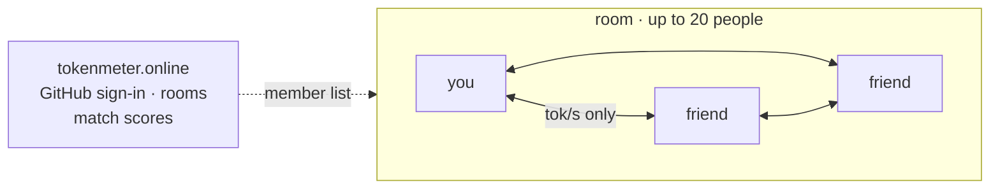
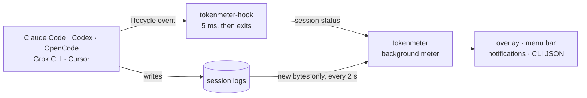
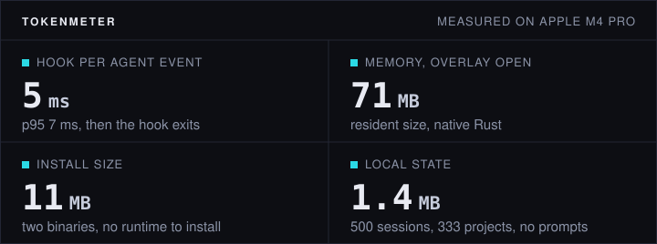

# TokenMeter

**See at a glance which AI coding agent is working, waiting, or needs you.**

[](https://github.com/helloimdevman/tokenmeter/actions/workflows/test.yml)
[](https://github.com/helloimdevman/tokenmeter/releases/latest)

[](LICENSE)

A small always-on-top meter for Claude Code, Codex, OpenCode, Grok CLI, Cursor, and 44 more coding agents. It reads the agents' own local logs: no API key, and metering never touches the network.

**New in 0.2.0: [Token League](#token-league-race-your-friends).** Make a room, invite your friends, and race your agents live, peer to peer.

[한국어](README.ko.md) · [Reference (Korean)](docs/reference.ko.md) · [Add an agent](docs/add-service.md)

```text
┌────────────────────────────────────────────────────┐
│ TOKENMETER                                    TODAY │
│ 478 total output tok/s       API-equivalent $15.8599 │
│ ██████████████░░░░░░░░░░░░░░░░░░░░░░░░           ▏ │
│ in 1.2M         out 84.0k      cache 23.5M         │
├────────────────────────────────────────────────────┤
│ STATUS  PROJECT        MAIN/s      TOTAL    CONTEXT  │
│ 작업    api-server       412/s      84.0k      31%  │
│ 대기    web-client          —      21.7k      75%  │
│ 확인    mobile              3/s       8.1k  95% · high │
└────────────────────────────────────────────────────┘
```

| Status | Meaning |
|---|---|
| `작업` Work | Tokens are arriving |
| `대기` Wait | Turn finished, your move |
| `확인` Check | The agent asked for permission or input. The only status that sends a notification |
| `종료` Done | Session ended |

Context changes color at 70% and 90%. Dollars are API list-price estimates, not invoices. Labels switch to English in settings (`⋯`).

## Token League: race your friends

Make your own room, send the invite link, and race. Every friend's live output rate shows up on your meter, and a timed match crowns a winner.

```text
┌────────────────────────────────────────────────────┐
│ TOKENMETER                                   TODAY │
│ 412 total output tok/s      API-equivalent $3.2104 │
│ ██┃███████████░░░░┃░░░┃░░░░░░░░░░░░░░░           ▏ │
├────────────────────────────────────────────────────┤
│ LEAGUE                                    3 people │
│ ● mina                                     980.4/s │
│ ● joon                                     655.0/s │
│ ● alex                                      12.3/s │
└────────────────────────────────────────────────────┘
```

<sub>Illustration. Each friend is a colored needle on your gauge and a row in the League tab, fastest first.</sub>

```bash
tokenmeter league login                  # sign in with GitHub; no permissions requested
tokenmeter league open                   # new room + invite link (tokenmeter.online/j/<id>)
tokenmeter league join <invite link>     # your friends run this
tokenmeter league match start --minutes 120 --rule output   # host starts a race: 10 min to 7 days, output or cost
tokenmeter league match                  # standings; the final result arrives as a notification
```

`tokenmeter league logout` disconnects this device; `tokenmeter account delete` deletes the account.

### Peer to peer by design



- Meters in a room connect directly over QUIC ([iroh](https://github.com/n0-computer/iroh)) and fall back to a relay only when a network blocks it. The server handles sign-in, member lists, and match scores; it never sees live rates.
- A meter sends only a number (`{"tps": 123.4}`). Names come from the server's member list, so nobody can post as someone else. Direct connections let members see each other's IP address.
- Anyone can open rooms: up to 20 people each, 8 rooms per person. Match scores are each member's output (or cost) between start and end, taken from usage sync. Friend rooms run on trust: cost is what each meter reports.
- A global league with seasons and a public board is planned on the same opt-in usage sync that shipped in 0.1.0.

## How it works



## By the numbers



<sub>Measured 2026-09-26 on an Apple M4 Pro, macOS 26.6, TokenMeter 0.1.0, 16 live sessions. Hook: 300 runs with the meter running. Memory: median resident size over 10 minutes. Install: macOS arm64 release assets (18 MB on Linux x64). 144 tests run on every pull request.</sub>

## Install

macOS or Linux:

```bash
curl -fsSL https://raw.githubusercontent.com/helloimdevman/tokenmeter/main/install.sh | sh
```

The script downloads two binaries from the latest release, checks them against `SHA256SUMS`, puts them in `~/.local/bin` (`TOKENMETER_INSTALL_DIR` overrides), and installs the hooks. Restart any agent that was already running, then send one prompt; older sessions are not measured. Nothing on screen? `tokenmeter doctor`.

| Agent | Tokens & cost | Live status |
|---|:-:|:-:|
| Claude Code · Codex · Grok CLI | ✓ | ✓ |
| OpenCode | ✓ | ✓ generated plugin |
| Cursor (IDE · CLI) | — | ✓ |
| Amp, Augment Code, Cline, Roo Code, Kilo, Goose, GitHub Copilot CLI, Qwen Code, Kimi, pi and about 30 more | ✓ | — |

Any other agent that writes logs can be added with config only: [guide](docs/add-service.md).

## Use

- Drag to move. `S` `M` `L` switch between meter only, sessions, and full detail. `×` hides the window; measuring continues.
- On macOS the meter also lives in the menu bar: left-click folds the window, right-click opens the menu.
- The big number is total output tok/s including sub-agents; session rows show the main model only. Both are log arrival rates, not provider benchmarks.

<details>
<summary>Commands</summary>

```bash
tokenmeter status --json          # snapshot for scripts
tokenmeter watch --jsonl
tokenmeter receipt --format markdown
tokenmeter quota                  # remaining Claude/Codex/Grok plan windows
tokenmeter services               # detected logs and hook state
tokenmeter doctor [--json]        # validate parsers and install (JSON has no home paths or prompts)
tokenmeter adapter init gemini-cli --log ~/.gemini/tmp
tokenmeter adapter check ./gemini-cli-adapter
tokenmeter share on|off|preview   # anonymous usage stats (opt-in)
tokenmeter account delete         # delete what this device sent
tokenmeter meter off              # hide overlay; keep measuring
tokenmeter off | on               # stop or resume measuring; keep hooks
tokenmeter update on|off|now      # daily stable-release updates, off by default
tokenmeter uninstall [--purge]    # hooks only, or also daemon, local state, league tokens
```

The wheel scrolls over a list row and resizes the window elsewhere. `⌘K`/`Ctrl+K` opens quick search. To stop measuring from the UI, choose `TokenMeter 종료 · 측정 중지` in settings or the menu bar menu. Optional agent skill: `npx skills add helloimdevman/tokenmeter -g -a claude-code` adds `/tm`, `/tm-meter`, `/tm-measure`, `/tm-doctor`.

</details>

## Privacy

- Reads agent logs (which can contain prompts) but stores allowlisted metadata only: never prompts, responses, tool commands, or file names. Public JSON also drops paths, session IDs, and routing URLs.
- The quota view reuses credentials Claude, Codex, or Grok already stored. Anonymous sharing is opt-in (the installer asks once) and sends hourly token counts per tool, route label, and model family; `tokenmeter share preview` shows the next upload. [Protocol](docs/protocol/README.md).
- Token League is opt-in too. GitHub login tokens are checked once and discarded. The server keeps your GitHub id and login, your rooms and a per-device iroh EndpointId; with sharing off it takes one hourly total only while a match runs. Anyone who knows your EndpointId (current or past room members) can learn your public IP and local addresses while the meter is in a room.
- State: `~/Library/Application Support/tokenmeter` (macOS) or `${XDG_STATE_HOME:-~/.local/state}/tokenmeter` (Linux). Overrides: `${XDG_CONFIG_HOME:-~/.config}/tokenmeter`.

Updates are off until `tokenmeter update on`, and install only stable releases that match `SHA256SUMS`. To remove: `tokenmeter uninstall`, then delete `~/.local/bin/tokenmeter` and `~/.local/bin/tokenmeter-hook`.

## Contributing

Adapters, provider entries, bug reports, and fixes are welcome: see [CONTRIBUTING.md](CONTRIBUTING.md), ask in [Discussions](https://github.com/helloimdevman/tokenmeter/discussions), and report security issues privately per [SECURITY.md](SECURITY.md). Created and maintained by imdevman under the [MIT License](LICENSE).
